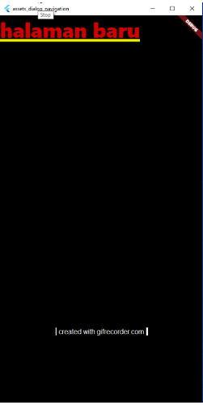
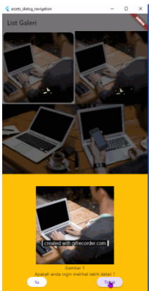

Soal Prioritas 1 (Nilai 80)
    Manfaatkan project yang telah kalian buat pada tugas sebelumnya dan lakukan hal-hal berikut.

 1.   Buat halaman baru dan buat sebuah galeri yang menampilkan gambar gambar dalam bentuk grid!
 2.  Gunakan Gridview saat pembuatan soal no 1!
 3.  buatlah agar setiap gambar dapat ditampilkan pada bottomsheet saat ditekan
 4.  Pada bottomsheet , berikan 2 pilihan ya & tidak. Jika memilih ya maka akan masuk ke halaman baru dan jika memilih tidak akan menutup dialog

hasil output :
  || halaman baru
 || bottomsheet
