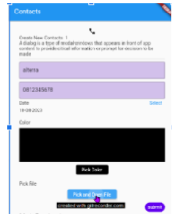

Soal Prioritas 2 (Nilai 20)
 1.  Pasang drawer pada aplikasi kalian dan berfungsi button untuk berpindah halaman.
 2.  Terdapat 2 button pada drawer tersebut yaitu Contact dan Galeri.
 3.  Jika Contact di tekan maka akan mengarah ke halaman contact.
    

 4.  Jika Galeri di tekan akan mengarah ke halaman List Galeri.
    

 5.  Modifikasi navigasi aplikasi yang telah dibuat dengan menggunakan routes.
    
 6.  hubungkan setiap halaman yang telah kalian buat sampai sekarang dengan navigation di flutter.